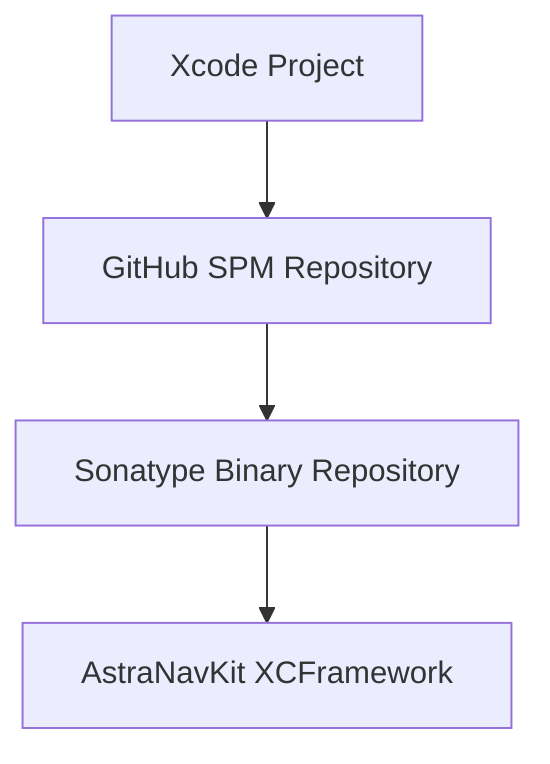

# AstraNavKit


**AstraNavKit** is the iOS SDK for the AstraNav® patented M-GPS® positioning and navigation solutions that harness the Earth’s own ambient magnetic field, so it works wherever you are..

This repository provides the **Swift Package Manager (SPM) wrapper** used to integrate the AstraNavKit binary framework into iOS applications.  
The compiled XCFramework is securely distributed via the AstraNav package repository.

---

# Quick Start

1. **Accept the Sonatype repository invite** you receive from AstraNav.
2. **Notify AstraNav** after accepting the invite so repository permissions can be assigned to your account.
3. **Generate a User Token** in the Sonatype portal.
4. **Add the token to your macOS Keychain** (one‑time setup).
5. **Add the package dependency in Xcode** using the GitHub URL for this repository.

Once these steps are complete, Xcode will automatically download the AstraNavKit framework.

---

# How AstraNavKit Distribution Works



1. Xcode resolves the package using the **GitHub SPM repository**.
2. The `Package.swift` file points to the **binary XCFramework**.
3. The XCFramework is securely downloaded from the **Sonatype repository** using your credentials.

---

# Requirements

| Requirement | Version |
|-------------|--------|
| iOS | 13.0+ |
| Xcode | 15+ |
| Swift | 5.9+ |

---


# Repository Access Setup

The AstraNavKit binary framework is hosted in a private package repository.  
You must configure authentication before Xcode can download the framework.

---

# 1. Accept the AstraNav Repository Invite

You will receive an email invitation to access the AstraNav package repository.

1. Open the invitation email  
2. Click **Accept Invite**  
3. Sign in to the repository portal:

https://astra-navigation.repo.sonatype.app

### Important

After accepting the invite and successfully signing in, **please notify the AstraNav team**.

Your account must be assigned the required **read‑only repository permissions** before the SDK can be downloaded.

Once your access privileges have been assigned you can continue with the next steps.

---

# 2. Generate a User Token

Downloads require a **User Token**.

1. Sign in to the repository portal  
2. Open your **User Profile**  
3. Select **User Token**  
4. Click **Reset User Token**

Record the following:

- Token Name  
- Token Password  

These credentials will be used by Xcode to download the SDK.

---

# 3. Add Credentials to macOS Keychain

Open **Terminal** and run:

```bash
security add-internet-password -a "<TOKEN_NAME>" -s "astra-navigation.repo.sonatype.app" -r htps -w "<TOKEN_PASSWORD>" -U
```

When Xcode first downloads the framework you may be prompted to allow Keychain access.

Select **Always Allow**.

---
# Installation

AstraNavKit is distributed using **Swift Package Manager (SPM)**.

### Step 1 — Add the package in Xcode

Open your project and select:

File → Add Package Dependencies…

Enter the repository URL:

https://github.com/AstraNav/astranavkit-public

Select the version rule:

Up to Next Major Version

Then add the **AstraNavKit** library to your app target.

---

# Usage

Import AstraNavKit in your project:

```swift
import AstraNavKit
```

---

# Troubleshooting

## Authentication Error

If you encounter errors such as:

- `could not be resolved`
- `401 Unauthorized`

Verify that:

- You accepted the Sonatype repository invite
- AstraNav has assigned your repository permissions
- Your User Token is correct
- The Keychain entry exists for `astra-navigation.repo.sonatype.app`

You can reset Swift Package caches in Xcode:

File → Packages → Reset Package Caches

---

# Continuous Integration

CI environments typically cannot use macOS Keychain. Instead configure credentials using `.netrc`.

Create:

```
~/.netrc
```

Contents:

```
machine astra-navigation.repo.sonatype.app
login <TOKEN_NAME>
password <TOKEN_PASSWORD>
```

Secure the file:

```bash
chmod 600 ~/.netrc
```

---

# License

AstraNavKit is proprietary software distributed under license.

For licensing and access contact:

AstraNav  
https://astranav.com
